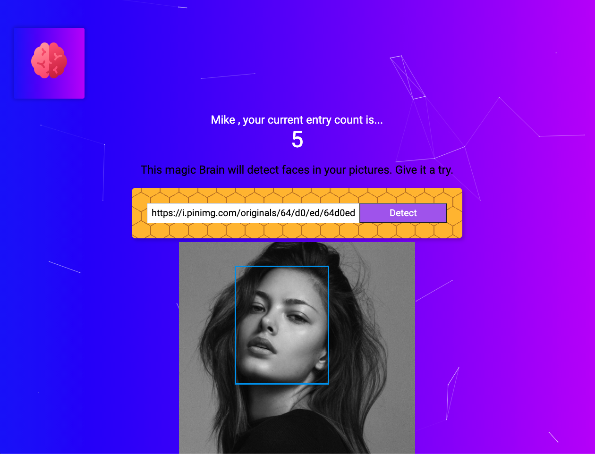

# Facial Recognition App

  

    
  

 
This Facial Recognition App takes your photos and identifies faces.

## What is This?

This is the final code-along project from the Udemy Zero to Mastery Web Development Course. This application let's users register and create logins to submit photo URL's through a machine learning API for facial recognition. The application keeps score on the amount of photos the user has submitted over time. It was built with React.js, Express, and PostgreSQL.

The sites currently live on Heroku, 👉🏼 &nbsp;[here](facerecognition23.herokuapp.com/)! Feel free to sign up and play around with the application!

## Project Goals

The Udemy course taught HTML, CSS, Javascript and React.js. There were tons of mini projects and code-along exercises throughout the course but this project was the one I looked forward to most. We wrote the code for the application from scratch, then shown how to deploy it live!

In the future, I'd like to make it more my own; change the background, move components around and try different things. Right now, it's someone else's code but still something that I learned a lot from.
